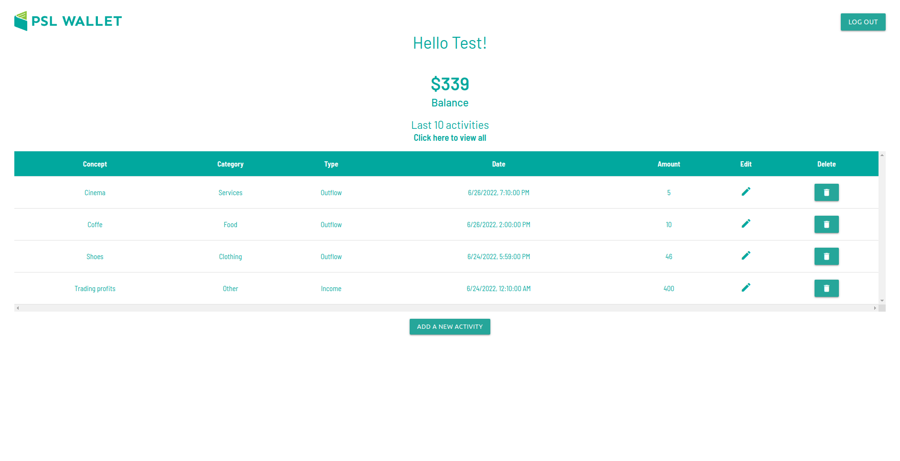
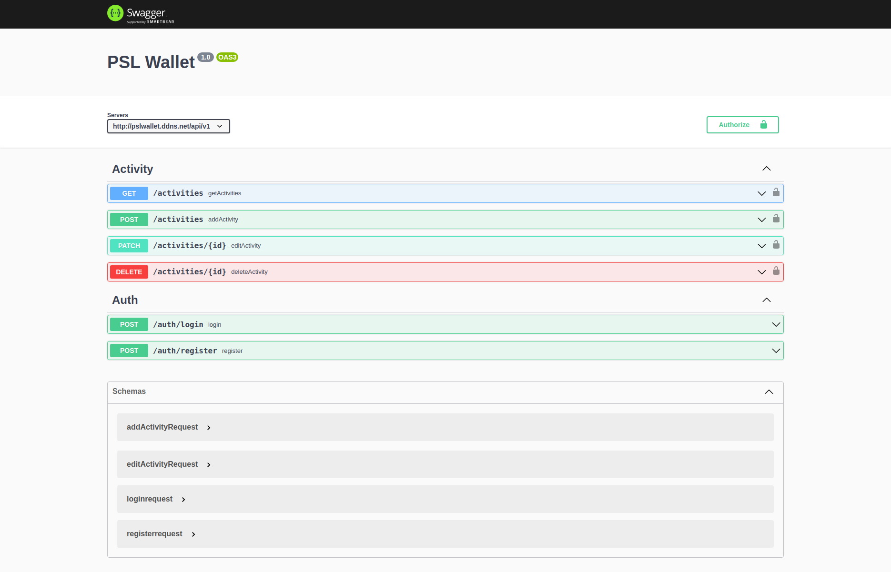

# PSL Wallet
### Administrador de presupuesto personal
### 🚀 [Para ver una demo de la web pulsa aquí](http://pslwallet.ddns.net/) [o aquí](http://ec2-18-230-87-228.sa-east-1.compute.amazonaws.com/)
¡Instalada en AWS EC2 y RDS!

### :book: [Documentación de la API](http://pslwallet.ddns.net/api-docs/)


## 🔧 Esta aplicación fue construida utilizando:
- TypeScript
- React
- Redux
- Materialize
- SASS
- Node Js
- Express
- MySQL

---

## :hammer: Instalación:
1. Ejecutar en el motor MySQL el script /server/databases/pslwallet.sql para generar la DB y su estructura
2. Crear un usuario en el motor con permisos de escritura y lectura sobre la DB generada por el script (pslwallet)
3. Crear y configurar /server/.env con los parámetros indicados en /server/.env_sample
4. Crear y configurar /client/.env con los parámetros indicados en /client/.env_sample
5. Posicionarse en la carpeta /client/, instalar las dependencias y transpilar el front-end:
```bash
yarn install && yarn run build
```
6. Posicionarse en la carpeta /server/, instalar las dependencias y transpilar el back-end:
```bash
yarn install && yarn run build
```
7. Iniciar el servidor:
```bash
yarn run start
```
8. En consola se mostrará el puerto que se está escuchando y en el cual se verá la web, por defecto el 5000
ej. http://localhost:5000/